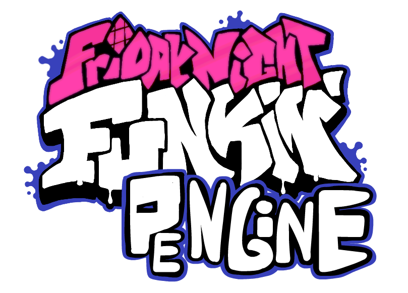

# Friday Night Funkin': PEngine
<p align="center">
  
</p>

Engine made mainly to improve vanilla client and make modding easier and MUCH faster.
## Setting Shit up
1. Install [Haxe](https://haxe.org/download/) and [HaxeFlixel](https://haxeflixel.com/documentation/install-haxeflixel/) or if you already have installed update Haxe and HaxeFlixel to latest version so it doesn't throw exceptions when compiling
2. Run [InstallLibraries.bat](https://raw.githack.com/Paidyy/Funkin-PEngine/main/art/installLibraries.bat) or install these libraries using Command Line:
``` bat
haxelib install flixel-addons
haxelib install flixel-ui
haxelib install hscript
haxelib git discord_rpc https://github.com/Aidan63/linc_discord-rpc
haxelib install openfl-webm
haxelib git yaml https://github.com/Paidyy/haxe-yaml.git
haxelib install linc_luajit
haxelib install udprotean
haxelib git linc_clipboard https://github.com/josuigoa/linc_clipboard.git
```
3. And to compile just type ```lime test windows -debug``` or ```lime test windows``` in current folder command line

*Message to motherfuckers from gamaverse: this engine supports html5 partially, have fun on trying to ~~port~~ steal someone's mod to your garbage site <3*
## Nice Stuff / Features
* 6K Mania Support
* Multiplayer (in very early phase, access it by pressing M in main menu)
* Action Notes
* Custom Skins (no need to change character in chart editor!)
* Make mods without touching code
* Modcharts
* 0.2.8 Version stuff ported like: Week 7, Note Splashes etc.
* Configs are in YAML instead of JSON so it is easier to read them
* Dialogue Cutscenes (not finished, still meh)
* Lua Support
* And some fixes to Vanilla
## Credits
### PEngine
- [Paidyy](https://paidyy.newgrounds.com/) - PEngine Programmer
### Special Thanks
- [PolybiusProxy](https://github.com/brightfyregit/Friday-Night-Funkin-Mp4-Video-Support) - Video Loader for HaxeFlixel
### Friday Night Funkin'
- [ninjamuffin99](https://twitter.com/ninja_muffin99) - Programmer
- [PhantomArcade3K](https://twitter.com/phantomarcade3k) and [Evilsk8r](https://twitter.com/evilsk8r) - Artists
- [Kawaisprite](https://twitter.com/kawaisprite) - Musician
